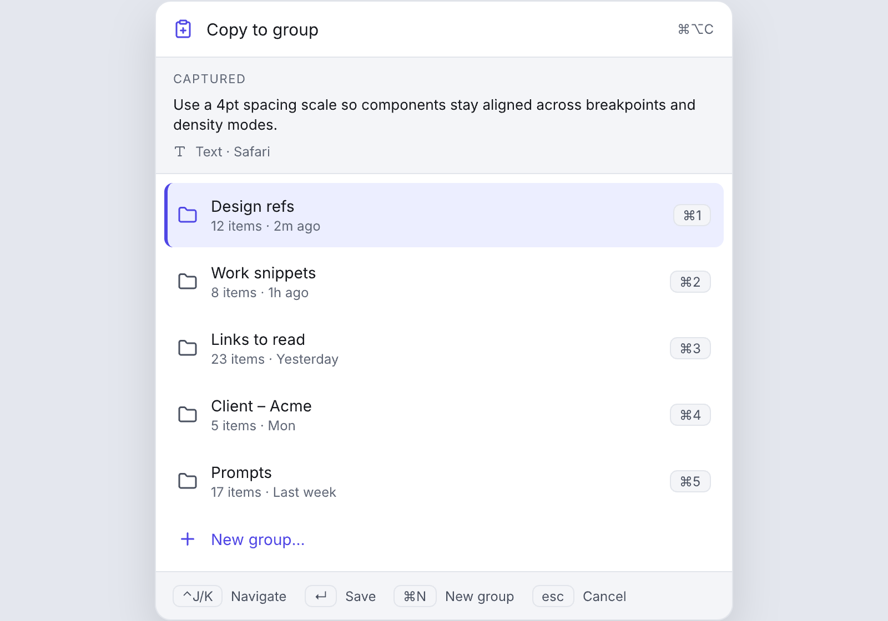
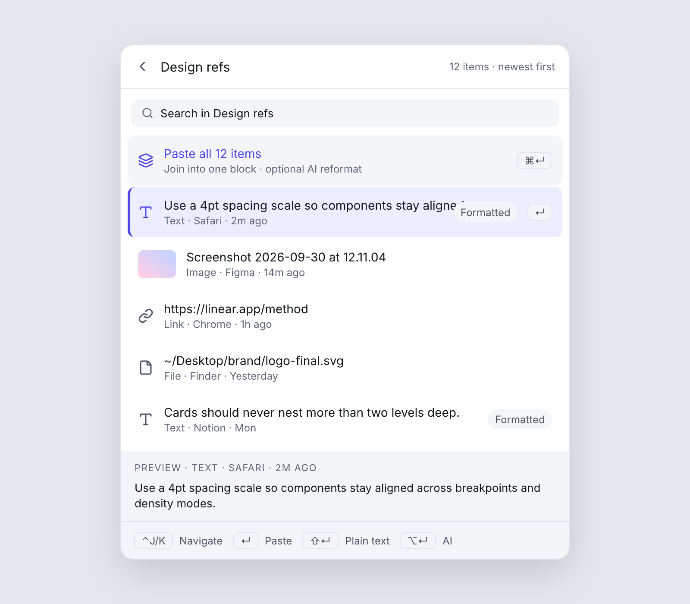
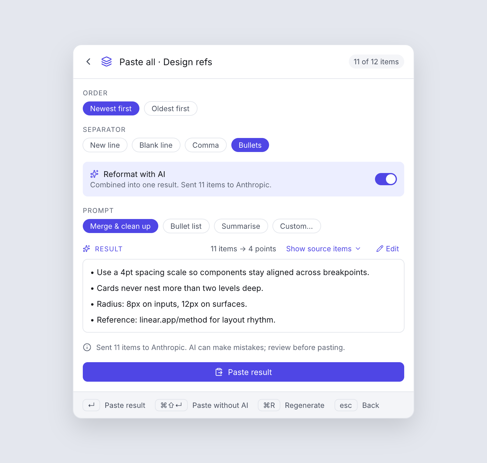

# lazyclipboard

A keyboard-first clipboard organizer for macOS, Windows and Linux. Copy into a named group with a global shortcut, paste from a group through a floating panel, and join a group into one block with Paste All. AI reformat and summary are optional and use your own key.

Status: design complete, implementation not started. See [DESIGN.md](DESIGN.md) and `lazyclipboard.pen`. The images below are designs, not the running app.

## What it does

**Copy to group.** Select anything in any app and press the shortcut (`⌘⌥C` on macOS, `Win+Shift+C` on Windows, `Ctrl+Alt+C` on Linux). Pick a group with `⌘1` to `⌘5` or create one. The item is saved with its source app.

**Paste from group.** Press the paste shortcut (`⌘⌥V`, `Win+Alt+V`, `Ctrl+Alt+V`), pick a group, pick an item, press `↵`. It lands in the app you were using. Typing searches across every group.

**Paste all.** Join a whole group into one block with your choice of order and separator, optionally summarised by AI. The original stays one chord away.

## Principles

- Everything stays on your device. No accounts, no sync, no background clipboard monitor.
- AI is optional and uses your own Anthropic, OpenAI or Gemini key, kept in the OS keychain.
- Every action shows its key cap. Every shortcut is remappable.

## License

Licensed under either of [Apache License 2.0](LICENSE-APACHE) or [MIT license](LICENSE-MIT), at your option.
